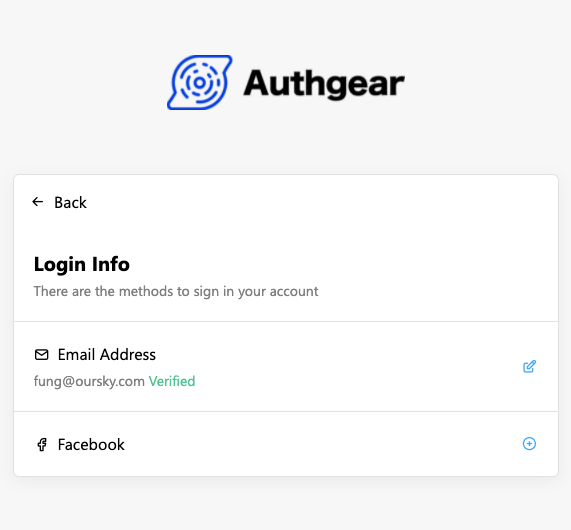

# Connect Apps to Facebook

## Create an App in Facebook for Developers

If you are using Authgear in your existing Facebook Apps, you may skip to the next step to set up the OAuth client. 

### Prerequisite

You will need a Facebook developer Account. Register as one by clicking **Get Started** in the [Facebook for Developers](https://developers.facebook.com/) website.

### Create an App

Click **Create App** in the [Apps](https://developers.facebook.com/apps) panel and choose your app type.

## Set up the OAuth Client

1. In the app panel, click **Add Product** next to **Products** in the sidebar.
2. Click the **Set Up** button in **Facebook Login**.
3. Go to **Settings** of **Facebook Login**.
4. Make sure **Client OAuth Login** and **Web OAuth Login** are enabled.
5. Add `https://<YOUR_AUTHGEAR_ENDPOINT>/sso/oauth2/callback/facebook` to **Valid OAuth Redirect URIs** and save the changes.


Redirect URI has the form of `/sso/oauth2/callback/:alias`. The `alias` is used as the identifier of OAuth provider. You can configure the `alias` in Authgear Portal.


## Configure Login with Facebook in Authgear Portal

### Get your OAuth Client details

After setting up the Facebook Login product, go to **Settings** -&gt; **Basic** in the sidebar.

Your will need the **App ID** and **App Secret** to configure Facebook Login.

### Configure in Authgear Portal

1. In the portal, go to **Authentication > Social / Enterprise Login**.
2. Enable **Login with Facebook**.
3. Fill in the **Client ID** with the **App ID** obtained from the previous step.
4. Fill in the **Client Secret** with the **App Secret** obtained from the previous step.
5. **Save** the settings.

🎉 Done! You have just added Facebook Login to your apps!

Your end-users can now sign in with Facebook on Authgear pre-built Log In and Sign Up page. Existing end-users can connect their account to Facebook in the [User Settings](../../integrate/auth-ui.md) page.

